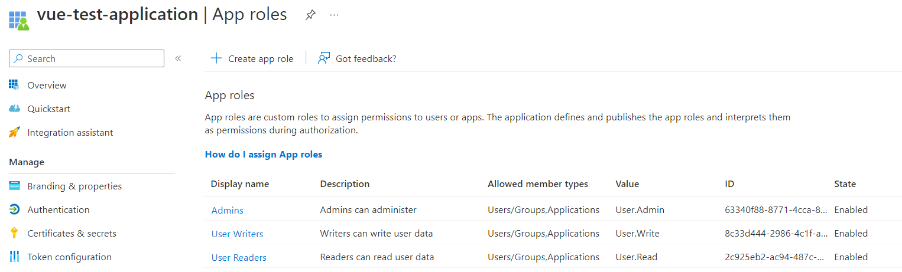
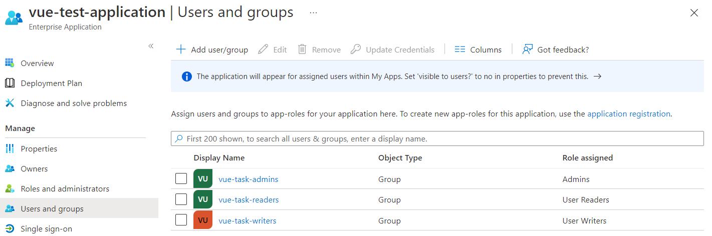
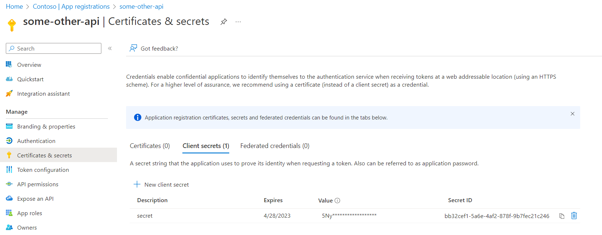
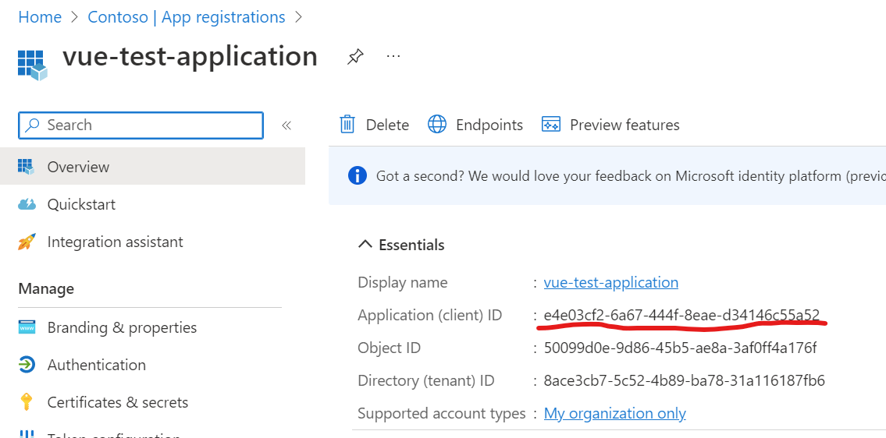
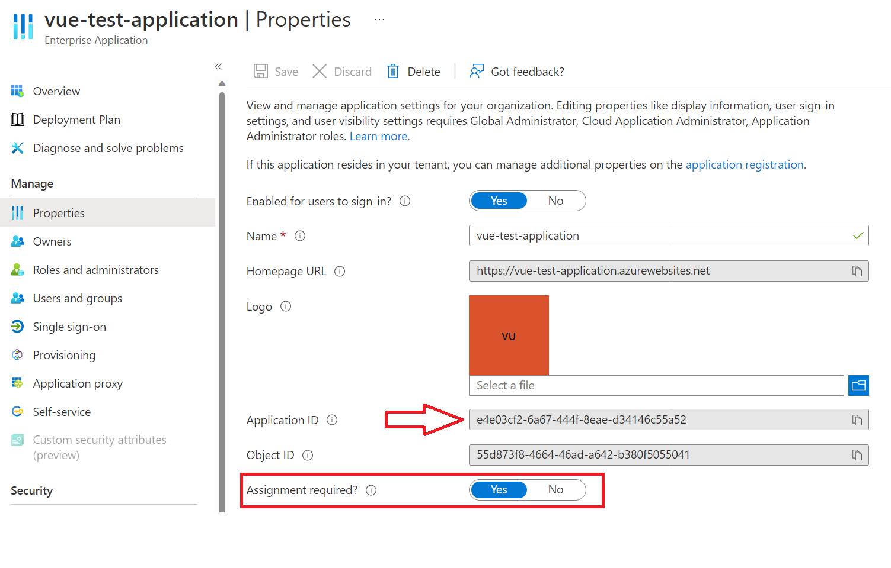

# About
Example Project to demonstrate how to use Vue.js with nodejs backend with Azure App Service EasyAuth.

## Why
As of time of writing, MSAL library does not support Azure's App Service EasyAuth.
[see](https://github.com/AzureAD/microsoft-authentication-library-for-js/issues/3972)

## Easy Auth
Easy Auth provides out of the box integration with various Identity providers (IDPs) including Azure Active Directory (AAD).

* [Configure Azure AD authentication - Azure App Service | Microsoft Learn](https://learn.microsoft.com/en-us/azure/app-service/configure-authentication-provider-aad)
* [Tutorial: Authenticate users E2E - Azure App Service | Microsoft Learn](https://learn.microsoft.com/en-us/azure/app-service/tutorial-auth-aad?pivots=platform-linux)

Once configured, Azure App Service will authenticate the user and inject [HTTP headers](https://learn.microsoft.com/en-us/azure/active-directory-b2c/configure-authentication-in-azure-web-app#retrieve-tokens-in-app-code) (that can't be spoofed).

## Frontend app (SPA)
Frontend single page application can read user information by calling `/.auth/me` endpoint.

```js
const response = await axios.get('/.auth/me');
```

## Backend app
Backend application (or server side rendered apps) can read user information by parsing one of the injected headers.

```js
const easyAuth = req.header("X-MS-CLIENT-PRINCIPAL"); // only app service can set this header

let bufferObj = Buffer.from(easyAuth, "base64");
let decodedString = bufferObj.toString("utf8");
let easyAuthObj = JSON.parse(decodedString);

let user = {};
// convert to user object
var claims = easyAuthObj.claims;
for (let i = 0; i < claims.length; i++) {
    if (!user[claims[i].typ] && claims[i].typ !== "roles") {
    user[claims[i].typ] = claims[i].val;
    }
}

user.roles = claims.filter((c) => c.typ === "roles").reduce((acc, c) => { acc[c.val] = true; return acc; }, {});

console.log(req.user);
```

## Roles
Application can define granular roles for users to maintain different level of access.

Roles have to be defined in AAD in the application registration.


Next users can be assigned to roles in AAD Enterprise Application.


When users signs in, roles are populated in claims.

```json
{
    "typ": "roles",
    "val": "User.Read"
},
{
    "typ": "roles",
    "val": "User.Write"
}
```

### External apps calling backend APIs
When external application needs to call backend app, it needs to be granted API permissions first.

External api will be called "some-other-api" in the screenshots below.

[Assign roles to applications](https://learn.microsoft.com/en-us/azure/active-directory/develop/howto-add-app-roles-in-azure-ad-apps#assign-app-roles-to-applications)


Once permissions are granted, secret needs to be added for service principal (some-other-api) to get the access token.


To get the token:
```bash
curl -X POST -H 'Content-Type: application/x-www-form-urlencoded' \
https://login.microsoftonline.com/8ace3cb7-5c52-4b89-ba78-31a116187fb6/oauth2/v2.0/token \
-d 'client_id=b764391f-efcc-4733-b695-8f1bd821c794' \
-d 'grant_type=client_credentials' \
-d 'scope=e4e03cf2-6a67-444f-8eae-d34146c55a52/.default' \
-d 'client_secret=xxxxx'
```
where:
* 8ace3cb7-5c52-4b89-ba78-31a116187fb6 - replace with your Azure AD tenant id
* client_id - is the application client_id of the service principal (some-other-api) requesting the token
* scope - has the id of the resource being requested - API with users
* client_secret - secret created for service principal (some-other-api)

Make a call to Users API:
```bash
 curl https://vue-test-application.azurewebsites.net/api/users -H 'Authorization: Bearer <<ACCESS_TOKEN_FROM_AZURE_AD>>'
 ```

 response should be:
 ```json
[{"id":"1","firstName":"first1","lastName":"last1","email":"abc@gmail.com"},{"id":"2","firstName":"first2","lastName":"last2","email":"abc@gmail.com"},{"id":"3","firstName":"first3","lastName":"last3","email":"abc@gmail.com"}]
```

## Restricting access
By default any application in the same active directory can request a token for Users API scope `e4e03cf2-6a67-444f-8eae-d34146c55a52/.default`.



In order to limit access to the application only to identities with roles assigned, change app registration settings.

[Easy Auth and the default scope](https://medium.com/airwalk/azure-app-service-easy-auth-and-the-default-scope-1fb0b65b4d26)

